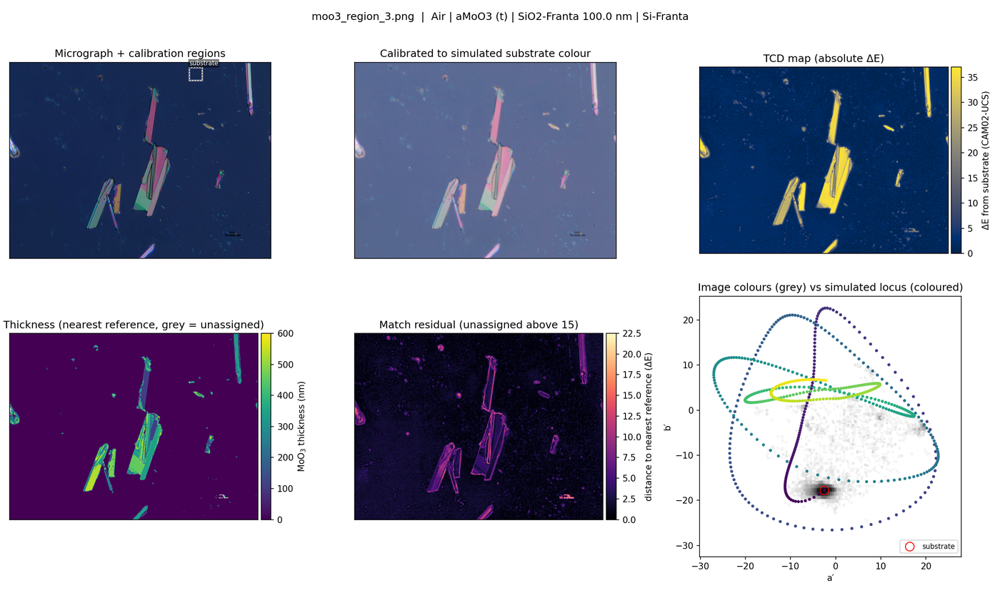

# Structural Color

Layer-number and thickness maps of thin layers on SiO₂/Si from an ordinary optical micrograph. A transfer-matrix (TMM) simulation predicts the colour of every candidate structure. Each pixel of the micrograph is then matched to the nearest simulated colour in the CAM02-UCS colour space, using total colour difference (TCD, ΔE).

Two systems are set up, both on 100 nm SiO₂ on Si:

- **Polystyrene (PS) bead layers**: 300 nm beads, layer number 0–5 plus the packing of the top layer.
- **Exfoliated MoO₃ flakes**: thickness 0–600 nm.

The same method is implemented in **Python** and in **MATLAB**, and the two give the same answer. On a 546 000-pixel test micrograph, 99.8 % of pixels receive identical values and every class fraction agrees to 0.01 percentage points.

## What is in this repository

| Path | Contents |
| --- | --- |
| `python/` | Package `tcd` and the command-line tool `run_tcd.py` (build references, map images, measure camera gamma) |
| `matlab/` | `tcd_build_reference`, `tcd_map_image`, `tcd_measure_gamma`, `tcd_colour`, two example scripts and a test suite. No toolboxes needed |
| `refs/` | Ready-made references `ps_D65.csv` and `moo3_D65.csv` (+ `.json` metadata, `.png` colour bar and ΔE curve) |
| `data/` | Optical constants (`nk_library.csv`), CIE 1931 2° colour-matching functions, CIE illuminants D65 / A / D50 |
| `examples/` | Five example micrographs (two PS, three MoO₃), a script that maps them all, and two result figures |
| `tests/fixtures/` | Reflectance spectra written by the original `TransferMatrix` code, used by both test suites |
| `legacy/` | The original step-by-step workflow (notebooks 1–5, scripts 6–8, `TransferMatrix/`), kept unchanged and described at the end |

## Try it on the bundled examples

```bash
pip install -r python/requirements.txt
python examples/run_examples.py             # results/examples/*.png, *_summary.csv, *_maps.npz
```
```matlab
cd matlab; run_examples                     % same five images, results in ../results/examples
```

PS beads imaged on a Chennai Metco microscope, calibrated on the bare substrate only: 18 % substrate, 22 % monolayer, 48 % bilayer, with a median match error of 2.6 ΔE.


Exfoliated MoO₃ flakes (region 3): flakes map to 100–550 nm. For about half of the flake pixels another thickness more than 40 nm away fits almost as well; see *Before you trust a map*.



## Quick start: Python

Python 3.10 or newer. From the repository root:

```bash
pip install -r python/requirements.txt
python python/tests/test_pipeline.py        # prints "all checks passed"

# PS beads: a window opens, click two opposite corners of a bare-substrate region
python python/run_tcd.py map --ref refs/ps_D65.csv --image my_beads.png --interactive --out results/my_beads

# MoO3 flakes: the substrate is taken as the dominant background colour
python python/run_tcd.py map --ref refs/moo3_D65.csv --image my_flakes.png --substrate auto --out results/my_flakes
```

The substrate region can also be given as `--substrate x,y,w,h` (pixels, 0-based top-left corner) or found from its colour with `--substrate-colour r,g,b` (values 0–1).

Each run writes:

| File | Content |
| --- | --- |
| `<out>.png` | Micrograph with regions, calibrated image, TCD map, layer/thickness map, match residual, image colours against the simulated locus |
| `<out>_summary.csv` | Area fraction per layer (PS) or per 50 nm bin (MoO₃), unassigned fraction, median residuals; for MoO₃ also the share of flake pixels with an equally good alternative thickness |
| `<out>_maps.npz` | Per-pixel `tcd`, `value` (nm or effective layer number), `residual`, `layers` (PS), `alt_value` / `alt_residual` (MoO₃) |
| `<out>_run.json` | Regions, colour-correction matrix and all settings |

A reference for a different stack:

```bash
python python/run_tcd.py build-ref --system PS --bead 500 --oxide 285 --out refs/ps_500nm_285ox.csv
python python/run_tcd.py build-ref --system MoO3 --t-max 400 --illuminant A --out refs/moo3_A.csv
```

Other `build-ref` options: `--max-layers`, `--packing-step`, `--model slab|hcp` (PS stacking), `--material <library name or n,k file>`, `--na <objective NA>` (cone-averaged s+p reflectance, Python only), `--illuminant <lamp spectrum CSV>`.

## Quick start: MATLAB

MATLAB R2021a or newer (tested on R2025b), no toolboxes. From the `matlab/` folder:

```matlab
addpath tests; run_tests        % prints "all checks passed"
run_examples                    % the five bundled micrographs, no clicking
example_ps                      % your own image: pick it, click two corners of a bare-substrate region
example_moo3
```

Or call the functions directly:

```matlab
ref = tcd_load_reference('../refs/moo3_D65.csv');           % or tcd_build_reference('MoO3', 'TMax', 400)
res = tcd_map_image('flakes.png', ref, 'Substrate', 'auto', 'TMax', 400, 'Out', '../results/flakes');
disp(res.summary)
```

In MATLAB, regions are `[x y w h]` with a **1-based** top-left corner. `tcd_build_reference(..., 'Out', file)` writes the same CSV + JSON format as Python, so a reference built in either language loads in the other. `help tcd_map_image` lists every option.

## How the mapping works

1. **Reference.** For every candidate structure, the TMM gives R(λ) over 360–830 nm. Each R(λ) becomes XYZ (CIE 1931 2°, chosen illuminant) and then CAM02-UCS (viewing conditions of Cobeldick's `sRGB_to_CAM02UCS.m`). PS layers are Maxwell-Garnett slabs of beads in air at fill fraction 0.6046 × packing.
2. **Linearise.** Camera values *v* become intensity *v*^γ (see *Camera gamma* below), after a 1.2 px Gaussian smoothing.
3. **Calibrate.** The median colour of a bare-substrate region is forced onto the simulated substrate colour by per-channel gains (exposure and white balance). Extra regions of known structure (`--anchor 1L@x,y,w,h`, MATLAB `'Anchors'`) turn the gains into a 3×3 matrix.
4. **TCD map.** ΔE of every pixel from the simulated substrate, in absolute CAM02-UCS units.
5. **Assign.** Each pixel takes the reference entry nearest in J′a′b′. Matching the full colour, not just ΔE, separates structures that have equal ΔE but different hue. Pixels farther than 15 ΔE from every entry (dust, edges, saturated pixels) stay unassigned. PS: the effective layer number (N − 1 + packing) is rounded half-up to a layer class and majority-filtered. MoO₃: the best alternative more than 40 nm away is reported too.

## Before you trust a map

- **Camera gamma.** The code assumes linear camera output (γ = 1). On the micrographs tested so far this fitted the simulation far better than the sRGB curve (median residual 2.6 vs 9.2 ΔE), but it is inferred, not known. Measure it once per camera. Image one bare-substrate field at 4–6 exposure times with auto-exposure, gain and white balance off, then run:

  ```bash
  python python/run_tcd.py gamma --images t5.tif t10.tif t20.tif t40.tif --exposures 5 10 20 40
  ```
  ```matlab
  tcd_measure_gamma({'t5.tif','t10.tif','t20.tif','t40.tif'}, [5 10 20 40])
  ```

  Pass the result as `--gamma` / `'Gamma'` (`srgb` for sRGB-encoded output).
- **The substrate region must be bare substrate.** The whole calibration rests on it.
- **Anchors only where SEM/AFM confirms the structure.** A spin-coated "monolayer" that is not close-packed, forced onto the dense-monolayer colour, shifts every other layer.
- **MoO₃ colours repeat about every 130 nm.** On the flakes tested, 35–52 % of flake pixels had a thickness at least 40 nm away that fits within 2 ΔE. Check `alt_value` / `altValue`, and cap the search with `--t-max` / `'TMax'` from one AFM-measured flake.
- **The PS model is an effective medium.** Maxwell-Garnett assumes particles much smaller than the wavelength; 300 nm beads are not, so scattering and photonic-crystal effects are missing. Treat layers above three as approximate: dense 2L to 5L all sit 14–18 ΔE from the substrate, close to one another.
- **Read the residual map.** A high residual marks colours the model cannot produce.

## The original step-by-step workflow

The numbered notebooks and scripts below are the first version of this work. They now live in `legacy/` and are otherwise kept as they were; run them from inside that folder. The Python and MATLAB code above supersedes steps 6–8.

### 01. TRANSFER MATRIX MODEL
The first step in the beginning of the identification is generation of a reference model. I used TMM package created by George F. Burkhard and Eric T. Hoke, whose original source can be found at [McGehee Group](https://web.stanford.edu/group/mcgehee/transfermatrix/). I modified the code to be usable in our case, by adding the Effective Medium Approximation. See, the real TMM model is a basic tool which simulates a scattering event between a light source and a physical system containing an arbitrary number of cuboidal layers - no other shape is allowed. This is even more limiting since only the thickness of the layer is important and not even the actual x,y-dimensions. To simulate results of photonic crystal arrays, we need a model which can introduce spacings in the layer, such that not all space in the thickness we mention is taken up by the material, but some by air, since it is a void. This is taken into consideration by the Maxwell-Garnett Equation which looks like this:
<p align="center">
  
</p>

This equation can simulate a matrix and inclusion, given a packing fraction, which we can calculate knowing the PS-beads configuration is HCP, as can be seen from the SEM images.
<p align="center">
  
</p>

Next, I'll take you through the steps in which the code shall be used to create the reference dataset:
The original code has been divided into two codes - TransferMatrix_multiple and TransferMatrix_packing. The former should be used whenever **variable thickness** has to be simulated - thus, let's say a Air/PS/SiO2/Si system, with thickness for PS varying from 0nm to 1500nm with step size of 300nm. The user can also update thickness of multiple layer too. The latter should be used whenever **variable packing-fraction** has to be simulated - thus, for the same system as mentioned above, the *packing-fraction* of PS varies over a range, while the thickness is contant.
<p align="center">
  
</p>

In the above image, the user has the ability to modify the initial thickness, the step-size and the final thickness of the PS beads to be simulated. The wavelength range is already mentioned, but can be modified - the ones currently written is the advisable range for converting a reflectance spectra into sRGB format. 
The layers is where the system has to be established. Starting with 'Air', whose thickness can be arbitrary, since it is not used for calculation but whose presence is essential for the code to run. The next is the layer which comes in contact with the light, followed by the rest in order. The names of the layers have to consulted from the file "Index_of_Refraction_library.xls", from which the complex refractive indices are actually taken for computation. Followed next is the thickness of each layer, in the same order in which the names have been written in the layers list. **incl** is a variable which dictates the packing fraction. The main function is hardcoded to only use EMA or packing fraction information only when **'PS-beads'** is mentioned. This could be changed in the main file TransferMatrix_multiple (line 93) or TransferMatrix_packing (line 98) as follows:
<p align="center">

</p>

Add more materials along with 'PS-beads' as per the interest.  

<p align="center">

</p>
This is where the physics and linear algebra takes over and scattering problem is solved using TMM formalism. The files are stored with filename as suggested by the variable with the same name. The user can keep *incl=1* if they don't want to use EMA. The main function called in the image above is TransferMatrix_multiple. This can be changed to TransferMatrix_packing and multiple *incl* values can be uploaded for each layer in order from near to light source to farther. Similar changes has to be done to the main TransferMatrix_packing code, to accomodate as much number of packing fraction for each layer.

If the user wants to have multiple packing-fraction for the same layer, a *for-loop* can be created which changes the *pf* every time a file is stored.

### 02. The colorbar
The next two codes titled *2_makes_colorbar_packing.ipynb* and *3_makes_colorbar_thickness.ipynb* is for creating colorbar, with the x-ticks showing packing fraction ranging from 0% to 100% for the former file and range of thickness for the latter file. Both the files in their first and second steps opens up a GUI for the user to select the folder containing a file name with a type as mentioned in step 3 below:\
<p align="center">

</p>

The filename should be of the type **PS_300nm4** or **PS_300nm** for former and latter files. The first number *300nm* suggests the thickness while the second number for *2_makes_colorbar_packing.ipynb* suggests packing, in percentage. IN step 5 for both the files, the user can modify the ticks for each files to be shown and how the final image generated should look. Both the files eventually store the images in *.png* format in the folder where the code resides.
<p align="center">
  
  
</p>

### 03. Storing the sRGB colors
The next file titled *4_stores_srgb_from_reflectance.ipynb* converts the reflection data to sRGB format, compatible to view in on digital screens. Nevertheless, the purpose of this file is larger and it converts a whole lot of file in series which are instead of to be viewed, better used to form a reference. Like the previous step, it opens a GUI prompt to select the folder contaning the file with certain filename, and the maximum thickness that has to be processed. It can skip files it the similar filenames are not found. The final sRGB data with corresponding thickness is then saved in a .txt file as shown below:
<p align="center">

</p>
This file is for storing sRGB values for all the files with differing thicknesses. If the user wants to store the percentages of certain thicknesses - basically the packing fraction, then they can use the *5_sRGB.ipynb*, which has the similar formatting as the previous file but each time a certain thickness is selected and the percentages in them is converted to a thickness using one-to-one mapping - a multiplication factor and a constant addition. 

### 04. CAM02-UCS, the ΔE reference and the micrograph (steps 6–8)

- `6_CIEUCS_from_sRGB.m` converts the stored sRGB values to CAM02-UCS J′a′b′. It needs Stephen Cobeldick's [CIECAM02 toolbox](https://github.com/DrosteEffect/CIECAM02) on the MATLAB path. `tcd_colour('srgb2cam02ucs', rgb)` in `matlab/` gives the same values without it.
- `7_TCDref_from_CIEUCS.m` joins the packing sweeps of 1–5 layers into one ΔE-versus-thickness curve and min–max normalises it. Its per-file export looks for `Lab_D65_*.txt` files, which step 6 does not write.
- `8_TCD_from_TCDref.m` maps a micrograph, but it does not use the reference from step 7. It divides each image's ΔE by that image's own maximum and shows pixels inside ΔE bounds typed by hand, so the bounds have to be retuned for every microscope. It also needs the Image Processing Toolbox.

Known limits of this chain: sRGB is clipped to [0, 1] before CAM02-UCS, camera values are decoded with the sRGB curve, and only the scalar ΔE is compared. `tcd_map_image` / `run_tcd.py map` replace steps 6–8 and remove all three.

## Licence and credits

- Copyright © 2025–2026 Kunal Kumar. This repository is free software, licensed under the **GNU General Public License v3** (see `LICENSE`).
- `legacy/TransferMatrix/` is adapted from the McGehee group's `TransferMatrix.m` (G. F. Burkhard and E. T. Hoke, Stanford), itself released under the GPL v3. The Python and MATLAB transfer-matrix code in `python/` and `matlab/` is a separate implementation of the published formalism (Pettersson et al., *J. Appl. Phys.* 86, 487, 1999).
- CAM02-UCS: Luo et al. (2006), with the viewing conditions of Stephen Cobeldick's CIECAM02 toolbox (Apache 2.0). Python colorimetry uses [colour-science](https://www.colour-science.org/) (BSD-3).
- Optical constants in `data/nk_library.csv`: Si and SiO₂ (Franta et al.), PS beads (Cauchy fit, Naglič et al. 2020), α-MoO₃ (Lajaunie et al., library name `aMoO3`). CIE tables from colour-science.
