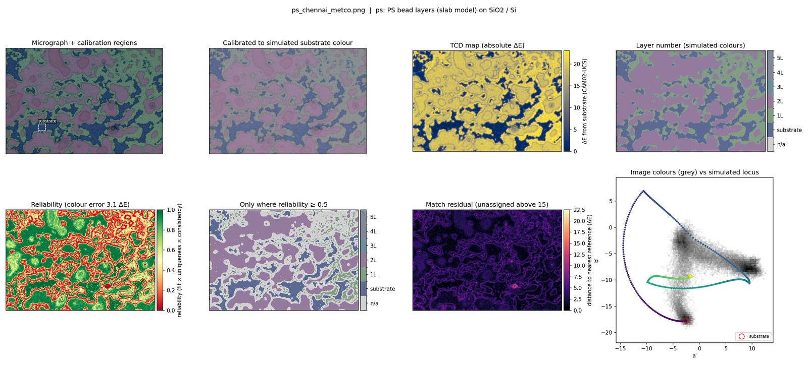
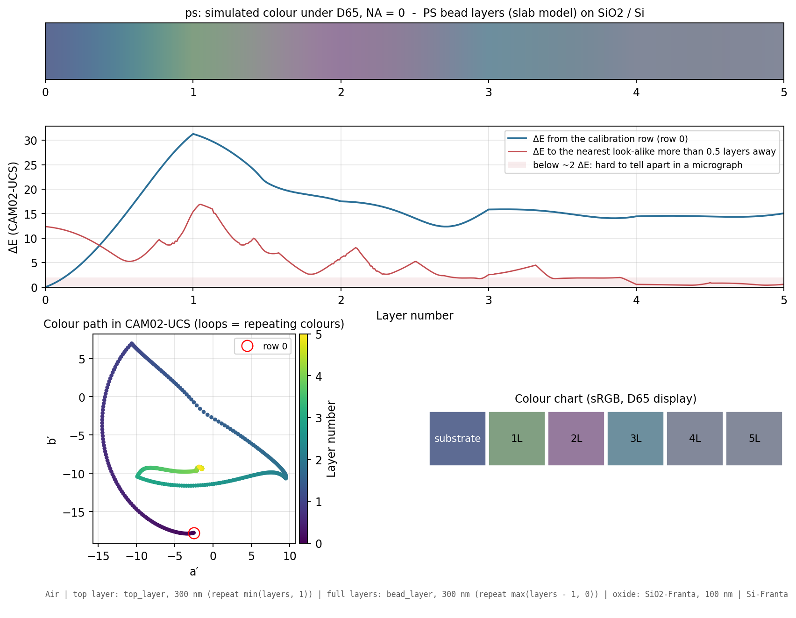

# Structural Color

This software finds the thickness of thin films from a colour photograph of an optical microscope. It can also count layers, for example layers of beads or of a 2D material.



## How it works, in short

A thin film has a colour because light reflects from its top and from its bottom. The colour changes with the thickness. The software does these steps:

1. It calculates the colour of each possible thickness of your sample.
2. It measures the colour of each pixel in your photograph.
3. It gives each pixel the thickness with the nearest colour.
4. It gives each pixel a reliability score between 0 and 1.

You do not need to know the physics to use the software. You must know which materials are in your sample.

## Words in this guide

| Word | Meaning |
| --- | --- |
| micrograph | The photograph from the microscope camera. |
| substrate | The bare wafer, without a film or a flake. Usually silicon with a layer of SiO₂. |
| system file | A text file that describes your sample: the layers, the materials and the range of thickness. |
| reference | A table of all possible structures and their calculated colours. The software makes it from a system file. |
| ΔE | A colour difference. A ΔE of 1 is almost not visible. A ΔE of 10 is easy to see. |
| check | A region of your micrograph with a thickness that you measured with a different method, for example AFM. |

## Before you start

You need:

- A computer with **Python 3.10 or newer**, or with **MATLAB R2021a or newer**. MATLAB needs no toolboxes.
- A micrograph in PNG, JPG, TIF or BMP format.
- The structure of your sample. For example: "MoO₃ flakes on 100 nm SiO₂ on silicon".
- If possible: AFM measurements of two or three flakes. They tell you how much you can trust the result.

## Install

### Python

1. On the GitHub page of this repository, click **Code** > **Download ZIP**.
2. Extract the ZIP file.
3. Open a terminal in the extracted folder.
4. Type this command to install the necessary packages:

   ```bash
   pip install -r python/requirements.txt
   ```

5. Type this command to test the installation:

   ```bash
   python python/tests/test_pipeline.py
   ```

   The last line must be `all checks passed`.

### MATLAB

1. Download and extract the repository (Python steps 1 and 2).
2. In MATLAB, go to the `matlab` folder of the repository.
3. Type this command to test the installation:

   ```matlab
   addpath tests; run_tests
   ```

   The last line must be `all checks passed`.

## Make your first map

The repository includes five example micrographs. Use them to learn the software.

1. Type this command (Python) to map all five examples:

   ```bash
   python examples/run_examples.py
   ```

   In MATLAB, type `run_examples` in the `matlab` folder.
2. Open the folder `results/examples`.
3. Open the file `ps_chennai_metco.png`. It looks like the figure at the top of this page.

Then map a micrograph of your own:

1. Type this command. Change `my_image.png` to the name of your file.

   ```bash
   python python/run_tcd.py map --ref refs/moo3_D65.csv --image my_image.png --interactive
   ```

   In MATLAB, type `tcd_map_image('my_image.png', '../refs/moo3_D65.csv', 'Out', '../results/my_image')`.
2. A window shows your micrograph.
3. Click two opposite corners of an area of bare substrate.
4. Open the result in the folder `results`.

> **Note:** `refs/moo3_D65.csv` is for MoO₃ on 100 nm SiO₂. For other samples, make your own reference first. Refer to [Use your own sample](#use-your-own-sample).

## Read the results

Each map makes four files. `<name>` is the name of your micrograph.

| File | Content |
| --- | --- |
| `<name>.png` | The figure with eight panels (table below). |
| `<name>_summary.csv` | The area of each thickness range or layer number, in per cent. |
| `<name>_maps.npz` (Python) or `<name>_maps.mat` (MATLAB) | The thickness, the reliability and the other values of each pixel. |
| `<name>_run.json` | All settings, the camera correction and the results of the checks. |
| `<name>_checks.csv` | Only if you give checks: the result of each check. |

The eight panels of the figure:

| Panel | What it shows |
| --- | --- |
| Micrograph | Your photograph. White boxes are calibration regions. Green or red boxes are checks. |
| Calibrated | Your photograph after the colour correction. |
| TCD map | The colour difference (ΔE) of each pixel from the substrate. |
| Thickness or layer map | The result. Grey pixels have no match. |
| Reliability | The score of each pixel. Green is high. Red is low. |
| Only where reliable | The result, but only for pixels with a score of 0.5 or more. |
| Match residual | The colour difference between each pixel and its best match. High values show colours that the model cannot make. |
| Colour plot | The colours of your pixels (grey) and the calculated colours (coloured line). The grey cloud must be near the line. |

## How much can you trust a map?

### The reliability score

The software gives each pixel a score from 0 to 1. The score has three parts:

| Part | Question |
| --- | --- |
| Fit | Can the calculated structure make the colour of this pixel? |
| Uniqueness | Do only thicknesses near the result make this colour? Or does a different thickness make almost the same colour? |
| Consistency | Do the neighbour pixels have the same result? |

The score is the product of the three parts. A low score tells you not to use that pixel.

> **CAUTION:** A high score does not prove that a thickness is correct. The score comes from the model. If the model is wrong, a wrong thickness can get a high score. Example: an incorrect oxide thickness in the system file. Use checks (next section) to find these errors.

### Checks: compare with AFM

A check is a small region with a thickness that you know from a different measurement. The software does not use checks for the calibration. It only compares them with the map.

1. Measure two or three flat flakes with AFM.
2. Find the same flakes in your micrograph.
3. Write down a box on each flake as `x,y,width,height` in pixels.
4. Add each box to the command with `--check`:

   ```bash
   python python/run_tcd.py map --ref refs/moo3_D65.csv --image my_image.png --substrate auto \
       --check 220nm@135,438,10,10 --check 257nm@249,475,10,10
   ```

   In MATLAB, add `'Checks', {'220nm', [136 439 10 10]; '257nm', [250 476 10 10]}`. MATLAB counts pixels from 1, Python from 0.
5. Read the result of each check in the terminal. `OK` means that most pixels agree within the tolerance. `DISAGREES` means that they do not agree.
6. If all checks disagree, do not use the map. Examine the system file, the camera gamma and the substrate region.

The checks also measure the colour error of the model. The software uses this value to calculate the reliability score. Without checks, it uses 3 ΔE.

### Result of a real check (MoO₃)

We compared the maps of three MoO₃ flakes with AFM. The flakes were 220–350 nm thick. We matched the AFM scans to the micrographs pixel by pixel. We used only flat areas of the flakes (about 18 000 pixels).

| Setting | Pixels within ±20 nm of AFM | Pixels within ±40 nm |
| --- | --- | --- |
| As supplied: 100 nm SiO₂, linear camera (γ = 1) | 27 % | 35 % |
| Camera decoded as sRGB (γ ≈ 2.2) | 3 % (and 92 % without a match) | — |
| 92–94 nm SiO₂ instead of 100 nm | 37–39 % | 50 % |

What we learned:

- **The camera saves linear data.** Use `--gamma 1` (the default) for this camera.
- **The oxide thickness is very important.** A change of 8–10 nm changed one flake from 0 % to 34–40 % correct. Measure your oxide, for example with ellipsometry. Put the measured value in the system file.
- **Thick MoO₃ flakes are difficult.** Above approximately 150 nm, the colours repeat. Different thicknesses then have almost the same colour.
- **One flake at 220 nm got a wrong result (342 nm) with a score of 0.91.** Only the check found this error.

The AFM check did not include flakes thinner than 200 nm. Thus, always add checks before you use a MoO₃ map for measurements.

## Use your own sample

To use a different sample, describe it in a system file. Then make a reference from the system file.

1. Copy the file `systems/template.jsonc` to `systems/my_sample.jsonc`.
2. Open the new file in a text editor. Change the layers, the materials and the range of thickness. The comments in the file tell you what to write.
3. Type this command to see the colour of some structures. Change `t=100` to a value of your sample.

   ```bash
   python python/run_tcd.py spectrum --system my_sample --at t=0 --at t=100
   ```

   In MATLAB: `tcd_spectrum('my_sample', struct('t', [0 100]))`.
4. Make sure that the colours look like your sample in the microscope.
5. Type this command to make the reference:

   ```bash
   python python/run_tcd.py build-ref --system my_sample
   ```

   In MATLAB: `tcd_build_reference('my_sample', 'Out', 'auto')`.
6. Open the reference sheet `refs/my_sample_D65.png`. The red curve shows the thicknesses that colour cannot identify.
7. Map your micrographs with `--ref refs/my_sample_D65.csv`.

For all options of system files, refer to [systems/README.md](systems/README.md).



## Add a material to the library

The library contains the optical constants (n and k) of the materials. If your material is not in the library, you can add it.

1. Type this command to see the materials in the library:

   ```bash
   python python/run_tcd.py materials
   ```

2. Get a file with the wavelength, n and k of your material. For example, download the CSV file from [refractiveindex.info](https://refractiveindex.info).
3. Type this command. Change the name, the file and the source.

   ```bash
   python python/run_tcd.py add-material MoS2 MoS2_downloaded.csv --source "Author et al. 2020, refractiveindex.info"
   ```

   In MATLAB: `tcd_add_material('MoS2', 'MoS2_downloaded.csv', 'Source', 'Author et al. 2020')`.
4. Read the warnings. A warning tells you if the data do not cover the visible range.
5. Use the new name in a system file: `"material": "MoS2"`.

The software saves the material in `data/materials/MoS2.csv`. To share it with other users, add this file to the repository with a pull request. For the file format, refer to [data/materials/README.md](data/materials/README.md).

## If something goes wrong

| Problem | What to do |
| --- | --- |
| `error: ... unknown key` | A word in the system file has a spelling error. The message shows the correct words. |
| `error: ... not in the n,k library` | Examine the name with the `materials` command, or add the material. |
| Many grey (unassigned) pixels | The colours do not match the model. Examine the system file, the oxide thickness and `--gamma`. |
| The grey cloud in the colour plot is far from the line | The calibration region is not bare substrate, or the model is wrong. Select a different substrate region. |
| A check shows `DISAGREES` | The model does not agree with your sample. Measure the oxide thickness. Examine the optical constants. |
| Python error about a missing module | Do the Python installation again (step 3). |

## More information

| Topic | Document |
| --- | --- |
| All options of system files | [systems/README.md](systems/README.md) |
| All Python commands and options | [python/README.md](python/README.md) |
| All MATLAB functions | [matlab/README.md](matlab/README.md) |
| Optical constants and the material library | [data/README.md](data/README.md) |

### What is in this repository

| Folder | Content |
| --- | --- |
| `systems/` | System files of example samples, a template and a guide. |
| `refs/` | References of the example samples and their reference sheets. |
| `python/` | The Python software (`run_tcd.py`) and its tests. |
| `matlab/` | The MATLAB software (`tcd_*` functions), examples and tests. |
| `data/` | Optical constants, added materials and colour tables. |
| `examples/` | Five example micrographs and a script that maps them. |
| `tests/fixtures/` | Spectra from the original code, for the tests. |
| `legacy/` | The first version of this work (unchanged). |

### The method, for specialists

1. **Reference.** A transfer-matrix calculation gives the reflectance of each structure from 360 nm to 830 nm. The colour is calculated for the CIE 1931 2° observer and the chosen illuminant, in CAM02-UCS.
2. **Linear camera values.** The software smooths the image (Gaussian, 1.2 px) and converts camera values *v* to *v*^γ.
3. **Calibration.** Gains make the substrate region match the calculated substrate colour. Anchors (regions of known structure) change the gains to a 3×3 matrix.
4. **Assignment.** Each pixel gets the structure with the nearest colour in J′a′b′. Pixels farther than 15 ΔE from all structures get no value. The software also reports the best match more than the "gap" away, because colours repeat.
5. **Reliability.** Fit = probability of the residual for a Gaussian colour error. Uniqueness = share of the posterior weight within the tolerance of the result. Consistency = agreement in a 5 × 5 window. The colour error is the camera noise plus the model error. For the formulas, refer to `python/tcd/reliability.py`.

Python and MATLAB give the same results. For a 546 000-pixel micrograph, 99.8 % of pixels get the same value.

## The original step-by-step workflow

The numbered notebooks and scripts below are the first version of this work. They now live in `legacy/` and are otherwise kept as they were; run them from inside that folder. The code above supersedes them: system files replace editing `TransferMatrix_multiple.m` / `TransferMatrix_packing.m` (step 01), the reference sheet replaces the colour bars of step 02, `build-ref` / `tcd_build_reference` replace the sRGB tables of step 03, and `map` / `tcd_map_image` replace steps 6–8.

### 01. TRANSFER MATRIX MODEL
The first step in the beginning of the identification is generation of a reference model. I used TMM package created by George F. Burkhard and Eric T. Hoke, whose original source can be found at [McGehee Group](https://web.stanford.edu/group/mcgehee/transfermatrix/). I modified the code to be usable in our case, by adding the Effective Medium Approximation. See, the real TMM model is a basic tool which simulates a scattering event between a light source and a physical system containing an arbitrary number of cuboidal layers - no other shape is allowed. This is even more limiting since only the thickness of the layer is important and not even the actual x,y-dimensions. To simulate results of photonic crystal arrays, we need a model which can introduce spacings in the layer, such that not all space in the thickness we mention is taken up by the material, but some by air, since it is a void. This is taken into consideration by the Maxwell-Garnett Equation which looks like this:
<p align="center">
  
</p>

This equation can simulate a matrix and inclusion, given a packing fraction, which we can calculate knowing the PS-beads configuration is HCP, as can be seen from the SEM images.
<p align="center">
  
</p>

Next, I'll take you through the steps in which the code shall be used to create the reference dataset:
The original code has been divided into two codes - TransferMatrix_multiple and TransferMatrix_packing. The former should be used whenever **variable thickness** has to be simulated - thus, let's say a Air/PS/SiO2/Si system, with thickness for PS varying from 0nm to 1500nm with step size of 300nm. The user can also update thickness of multiple layer too. The latter should be used whenever **variable packing-fraction** has to be simulated - thus, for the same system as mentioned above, the *packing-fraction* of PS varies over a range, while the thickness is contant.
<p align="center">
  
</p>

In the above image, the user has the ability to modify the initial thickness, the step-size and the final thickness of the PS beads to be simulated. The wavelength range is already mentioned, but can be modified - the ones currently written is the advisable range for converting a reflectance spectra into sRGB format. 
The layers is where the system has to be established. Starting with 'Air', whose thickness can be arbitrary, since it is not used for calculation but whose presence is essential for the code to run. The next is the layer which comes in contact with the light, followed by the rest in order. The names of the layers have to consulted from the file "Index_of_Refraction_library.xls", from which the complex refractive indices are actually taken for computation. Followed next is the thickness of each layer, in the same order in which the names have been written in the layers list. **incl** is a variable which dictates the packing fraction. The main function is hardcoded to only use EMA or packing fraction information only when **'PS-beads'** is mentioned. This could be changed in the main file TransferMatrix_multiple (line 93) or TransferMatrix_packing (line 98) as follows:
<p align="center">

</p>

Add more materials along with 'PS-beads' as per the interest.  

<p align="center">

</p>
This is where the physics and linear algebra takes over and scattering problem is solved using TMM formalism. The files are stored with filename as suggested by the variable with the same name. The user can keep *incl=1* if they don't want to use EMA. The main function called in the image above is TransferMatrix_multiple. This can be changed to TransferMatrix_packing and multiple *incl* values can be uploaded for each layer in order from near to light source to farther. Similar changes has to be done to the main TransferMatrix_packing code, to accomodate as much number of packing fraction for each layer.

If the user wants to have multiple packing-fraction for the same layer, a *for-loop* can be created which changes the *pf* every time a file is stored.

### 02. The colorbar
The next two codes titled *2_makes_colorbar_packing.ipynb* and *3_makes_colorbar_thickness.ipynb* is for creating colorbar, with the x-ticks showing packing fraction ranging from 0% to 100% for the former file and range of thickness for the latter file. Both the files in their first and second steps opens up a GUI for the user to select the folder containing a file name with a type as mentioned in step 3 below:\
<p align="center">

</p>

The filename should be of the type **PS_300nm4** or **PS_300nm** for former and latter files. The first number *300nm* suggests the thickness while the second number for *2_makes_colorbar_packing.ipynb* suggests packing, in percentage. IN step 5 for both the files, the user can modify the ticks for each files to be shown and how the final image generated should look. Both the files eventually store the images in *.png* format in the folder where the code resides.
<p align="center">
  
  
</p>

### 03. Storing the sRGB colors
The next file titled *4_stores_srgb_from_reflectance.ipynb* converts the reflection data to sRGB format, compatible to view in on digital screens. Nevertheless, the purpose of this file is larger and it converts a whole lot of file in series which are instead of to be viewed, better used to form a reference. Like the previous step, it opens a GUI prompt to select the folder contaning the file with certain filename, and the maximum thickness that has to be processed. It can skip files it the similar filenames are not found. The final sRGB data with corresponding thickness is then saved in a .txt file as shown below:
<p align="center">

</p>
This file is for storing sRGB values for all the files with differing thicknesses. If the user wants to store the percentages of certain thicknesses - basically the packing fraction, then they can use the *5_sRGB.ipynb*, which has the similar formatting as the previous file but each time a certain thickness is selected and the percentages in them is converted to a thickness using one-to-one mapping - a multiplication factor and a constant addition. 

### 04. CAM02-UCS, the ΔE reference and the micrograph (steps 6–8)

- `6_CIEUCS_from_sRGB.m` converts the stored sRGB values to CAM02-UCS J′a′b′. It needs Stephen Cobeldick's [CIECAM02 toolbox](https://github.com/DrosteEffect/CIECAM02) on the MATLAB path. `tcd_colour('srgb2cam02ucs', rgb)` in `matlab/` gives the same values without it.
- `7_TCDref_from_CIEUCS.m` joins the packing sweeps of 1–5 layers into one ΔE-versus-thickness curve and min–max normalises it. Its per-file export looks for `Lab_D65_*.txt` files, which step 6 does not write.
- `8_TCD_from_TCDref.m` maps a micrograph, but it does not use the reference from step 7. It divides each image's ΔE by that image's own maximum and shows pixels inside ΔE bounds typed by hand, so the bounds have to be retuned for every microscope. It also needs the Image Processing Toolbox.

Known limits of this chain: sRGB is clipped to [0, 1] before CAM02-UCS, camera values are decoded with the sRGB curve, and only the scalar ΔE is compared. `tcd_map_image` / `run_tcd.py map` replace steps 6–8 and remove all three.

## Licence and credits

- Copyright © 2025–2026 Kunal Kumar. This repository is free software, licensed under the **GNU General Public License v3** (see `LICENSE`).
- `legacy/TransferMatrix/` is adapted from the McGehee group's `TransferMatrix.m` (G. F. Burkhard and E. T. Hoke, Stanford), itself released under the GPL v3. `matlab/tcd_tmm.m` and `python/tcd/tmm.py` reimplement the same formalism (Pettersson et al., *J. Appl. Phys.* 86, 487, 1999), vectorised, generalised to any stack and extended to oblique incidence.
- CAM02-UCS: Luo et al. (2006), with the viewing conditions of Stephen Cobeldick's CIECAM02 toolbox (Apache 2.0). Python colorimetry uses [colour-science](https://www.colour-science.org/) (BSD-3).
- Optical constants in `data/nk_library.csv`: Si, SiO₂ and TiO₂ (Franta et al.), PS beads (Cauchy fit, Naglič et al. 2020), α-MoO₃ (Lajaunie et al., library name `aMoO3`). `systems/graphene.jsonc` uses the constant index of Blake et al., *Appl. Phys. Lett.* 91, 063124 (2007). CIE tables from colour-science.
