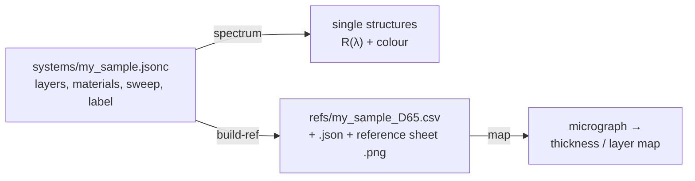
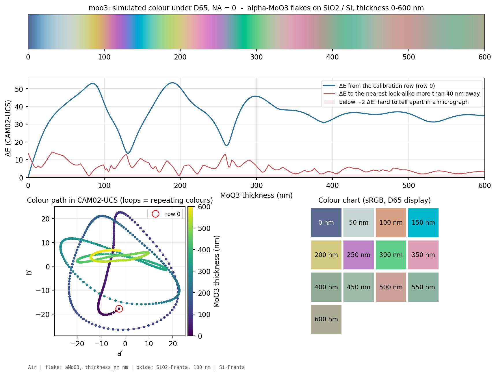

# Describing your own sample: system files

A **system file** tells the code what your sample is made of and what varies from place to place. From it, the transfer-matrix code simulates the colour of every candidate structure. Those colours form a *reference*, and the mapping code assigns each pixel of a micrograph to the closest candidate.



Python and MATLAB read the same files with the same rules, and give the same reference.

| Step | Python (from the repository root) | MATLAB (from `matlab/`) |
| --- | --- | --- |
| list materials and systems | `python python/run_tcd.py materials` | `tcd_materials` |
| check single structures | `python python/run_tcd.py spectrum --system my_sample --at t=120` | `tcd_spectrum('my_sample', struct('t', 120))` |
| build the reference | `python python/run_tcd.py build-ref --system my_sample` | `tcd_build_reference('my_sample', 'Out', 'auto')` |
| map a micrograph | `python python/run_tcd.py map --ref refs/my_sample_D65.csv --interactive` | `tcd_map_image('', '../refs/my_sample_D65.csv')` |

`--system my_sample` finds `systems/my_sample.jsonc`; a full path to a file elsewhere works too. `matlab/example_own_system.m` walks through the same steps section by section.

## Contents

- [Walkthrough: a new sample in five steps](#walkthrough-a-new-sample-in-five-steps)
- [The bundled systems](#the-bundled-systems)
- [Reference: every key](#reference-every-key)
- [Expressions](#expressions)
- [Modelling advice and limits](#modelling-advice-and-limits)
- [Troubleshooting](#troubleshooting)

## Walkthrough: a new sample in five steps

The example is a film whose thickness varies across the sample, on 90 nm SiO₂ / Si. The film's optical constants come from your own measurement.

### 1. Gather what the model needs

- **The stack**, from the light side down: every layer, its material, and its thickness (fixed or varying). Then the substrate, treated as infinitely thick.
- **Optical constants (n, k) for every material** over 360–830 nm. Check the library first (`materials` command). Otherwise put a file in `data/materials/` (format in [data/materials/README.md](../data/materials/README.md)), or use a Cauchy, Sellmeier or constant model.
- **What varies** across the sample (film thickness, number of layers, coverage, ...), and over what range.
- **What the bare region is.** You will mark a region of known structure, normally bare substrate, to calibrate the camera. That structure must be the first candidate.

### 2. Write the file

Copy [template.jsonc](template.jsonc), which is a working file with every option explained, to `systems/my_film.jsonc`, and cut it down:

```jsonc
// My film on 90 nm SiO2 / Si.
{
  "name": "my_film",
  "description": "Film X on 90 nm SiO2 / Si, 0-500 nm",
  "constants": {"oxide_nm": 90},
  "sweep": {"t": {"from": 0, "to": 500, "step": 1}},   // t = 0 (bare substrate) comes first
  "label": {"name": "t", "unit": "nm", "title": "Film thickness"},
  "ambient": "Air",
  "layers": [
    {"name": "film",  "material": "data/materials/film_X.csv", "thickness": "t"},
    {"name": "oxide", "material": "SiO2-Franta",               "thickness": "oxide_nm"}
  ],
  "substrate": "Si-Franta"
}
```

### 3. Check single structures

```bash
python python/run_tcd.py spectrum --system my_film --at t=0 --at t=100 --at t=200
```

This prints each stack as it was built, e.g. `ambient | film 100 nm | oxide 90 nm | substrate`, with its colour. It also plots R(λ) with colour swatches (`results/my_film_spectra.png`). Check that:

- the layers are in the right order;
- a zero-thickness layer disappears;
- the bare-substrate colour looks like your substrate in the eyepiece.

### 4. Build the reference and read its sheet

```bash
python python/run_tcd.py build-ref --system my_film
```

This writes `refs/my_film_D65.csv` (one row per candidate), `refs/my_film_D65.json` (label, stack, constants and the full system definition) and the **reference sheet** `refs/my_film_D65.png`:



| Panel | What it tells you |
| --- | --- |
| Colour strip | The simulated colour against the label: the "basis image" of the system |
| Blue curve | ΔE from the calibration row: how different each structure looks from the bare substrate |
| Red curve | ΔE to the **nearest look-alike**, the closest colour among structures more than `label.gap` away. Where it drops below about 2, colour alone cannot tell those structures apart. Restrict the range (`--max-value` when mapping) or add anchors |
| a′b′ path | The same colours in the CAM02-UCS plane; every loop is a colour that comes back |
| Colour chart | Swatches at round label values, to compare with what you see in the eyepiece |

The command also prints the share of candidates that have such a look-alike. For MoO₃ on 100 nm oxide it is 2 %, for PS beads 36 %, mostly 3–5 layers, and for graphene 73 %, because neighbouring layer counts differ by only about 2 ΔE.

### 5. Map a micrograph

```bash
python python/run_tcd.py map --ref refs/my_film_D65.csv --image my_image.png --interactive
```

Click two corners of a bare-substrate region. Then:

- **Read the residual panel.** It marks colours the model cannot produce.
- **Read the `covered px with an alternative ... within 2 dE` line of the summary.** It gives the share of the map that colour cannot settle.

If you know the structure of a region, for example from AFM, SEM or Raman, add it as an anchor: `--anchor 120nm@x,y,w,h`. Anchors refine the camera calibration from per-channel gains to a full 3×3 colour matrix.

## The bundled systems

| File | Sample | Shows how to |
| --- | --- | --- |
| [moo3.jsonc](moo3.jsonc) | α-MoO₃ flakes, 0–600 nm, on 100 nm SiO₂ / Si | the basic film-on-substrate sweep; constants for the oxide and range |
| [ps.jsonc](ps.jsonc) | 300 nm PS-bead layers (slab model), 0–5 layers × top-layer packing | mixtures (`ema`), a two-parameter sweep in two blocks, a computed label, whole-number classes, `repeat` |
| [ps_hcp.jsonc](ps_hcp.jsonc) | the same beads, close-packed layers | comparisons as on/off switches (`"repeat": "layers >= 2"`); alternative models of one sample |
| [sio2_on_si.jsonc](sio2_on_si.jsonc) | thermal oxide, 0–1000 nm | the simplest system; a check of a new microscope against wafers of known oxide thickness |
| [graphene.jsonc](graphene.jsonc) | graphene, 0–10 layers, on 285 nm SiO₂ | a constant complex index; layer counting with `classes` |
| [bragg_mirror.jsonc](bragg_mirror.jsonc) | 5-pair TiO₂ / SiO₂ quarter-wave mirror, λ₀ = 400–700 nm | a repeated group of layers; a calibration row outside the main sweep |
| [template.jsonc](template.jsonc) | polymer film with a rough top on SiO₂ / Si | every option, commented; Cauchy model; Bruggeman roughness layer; a label combining two parameters |

`refs/` holds the references and reference sheets of all of them except the template.

## Reference: every key

System files are JSON plus `//` comments: keys and text in double quotes, no comma after the last item. An unknown key is an error, so typos are caught. A `"notes"` key is allowed anywhere for comments that must survive in plain JSON tools.

### Top level

| Key | Required | Meaning |
| --- | --- | --- |
| `name` | yes | short name; default output is `refs/<name>_<illuminant>.csv` |
| `description` | | one line, shown on figures |
| `constants` | | `{"name": value}`; fixed numbers you may want to change without editing (see below) |
| `materials` | | `{"name": material}`; your own named materials, usable in layers |
| `ambient` | | material light comes from; default `"Air"` |
| `layers` | yes | list of layers and groups, **from the light side down** |
| `substrate` | yes | material below the last layer, semi-infinite |
| `sweep` | yes | the candidate structures |
| `label` | | the number reported per pixel |
| `optics` | | illuminant and objective NA |

### Constants and `--set`

```jsonc
"constants": {"bead_nm": 300, "oxide_nm": 100, "f_hex": "pi / (3 * sqrt(3))"}
```

A constant can be an expression of the constants above it. Change any of them when building, without editing the file:

```bash
python python/run_tcd.py build-ref --system ps --set bead_nm=500 --set oxide_nm=285   # -> refs/ps_bead_nm500_oxide_nm285_D65.csv
```
```matlab
tcd_build_reference('ps', 'Set', {'bead_nm', 500; 'oxide_nm', 285}, 'Out', 'auto')
```

Setting a name that is not a constant is an error. Sweep ranges can use constants (`"to": "t_max"`), so `--set t_max=300` shortens a sweep.

### Materials

Anywhere a material is expected you can write:

| Form | Example | Meaning |
| --- | --- | --- |
| library name | `"SiO2-Franta"` | a column of `data/nk_library.csv`; case, `-`, `_` and spaces are ignored |
| file | `"data/materials/MoS2.csv"` | (wavelength, n, k) file; looked up next to the system file, then from the repository root, then in `data/materials/` |
| your name | `"top_layer"` | an entry of `materials` (takes precedence over the library) |
| number | `1.45` | constant, non-absorbing |
| `{"n": .., "k": ..}` | `{"n": 2.6, "k": 1.3}` | constant complex index n + ik (k > 0 absorbs) |
| `{"cauchy": [A, B, C], "k": ..}` | `{"cauchy": [1.48, 0.0045, 0]}` | n = A + B/λ² + C/λ⁴, λ in µm |
| `{"sellmeier": {"B": [..], "C": [..]}, "k": ..}` | fused silica: `B = [0.696, 0.408, 0.897]`, `C = [0.00468, 0.0135, 97.9]` | n² = 1 + Σ Bᵢλ²/(λ² − Cᵢ), λ in µm, C in µm² |
| `{"ema": rule, "host": .., "inclusion": .., "fraction": ..}` | `{"ema": "maxwell-garnett", "host": "Air", "inclusion": "PS-beads", "fraction": "f_hex * packing"}` | a two-phase mixture, inclusion volume fraction 0–1 |

Mixing rules:

- **`maxwell-garnett`**: isolated spheres in a host, the rule of the original `TransferMatrix_packing.m`.
- **`bruggeman`**: both phases on an equal footing, e.g. rough or porous layers near 50 %.
- **`linear`**: volume-averaged permittivity.

Every number inside a material can be an expression of constants and sweep parameters. That is how the PS top layer's fill follows its packing.

### Layers and groups

```jsonc
"layers": [
  {"name": "top layer", "material": "top_layer", "thickness": "bead_nm", "repeat": "min(layers, 1)"},
  {"name": "pair", "repeat": "pairs", "layers": [
    {"name": "TiO2", "material": "TiO2-Franta", "thickness": "lambda0 / (4 * n_high)"},
    {"name": "SiO2", "material": "SiO2-Franta", "thickness": "lambda0 / (4 * n_low)"}
  ]},
  {"name": "oxide", "material": "SiO2-Franta", "thickness": "oxide_nm"}
]
```

| Key | Meaning |
| --- | --- |
| `material` | any material form above |
| `thickness` | nm; number or expression; must be ≥ 0 |
| `repeat` | how many identical copies (default 1); a whole number ≥ 0 or an expression; 0 removes the layer |
| `layers` | instead of `material` and `thickness`: a **group** of layers repeated as a block (nested groups are allowed) |
| `name` | shown in stack descriptions and error messages |

A layer whose thickness is 0 is left out. It changes nothing physically, since the interface matrices multiply out (I₁₂ I₂₃ = I₁₃). That is how the first candidate becomes the bare substrate.

### Sweep

Each combination of the sweep parameters is one candidate structure.

| Value | Example | Meaning |
| --- | --- | --- |
| number | `0` | one value |
| list | `[0, 10, 20]` | these values |
| range | `{"from": 0, "to": "t_max", "step": 1}` | both ends included; `"num"` instead of `"step"` gives that many evenly spaced values |
| `{"values": [...]}` | `{"values": [1, 2, 5]}` | same as a list |
| expression | `"2 * t"` | a **derived** parameter, computed from the others; not swept |

A list of blocks joins several sweeps. Every block must name the same parameters. PS uses this to put the bare substrate first and then sweep layers × packing:

```jsonc
"sweep": [
  {"layers": 0, "packing": 0},
  {"layers": {"from": 1, "to": "max_layers", "step": 1}, "packing": {"from": 0.01, "to": 1, "step": 0.01}}
]
```

Within a block, the first parameter varies slowest. **The first candidate (row 0) is the calibration structure**: the region you mark as "substrate" in a micrograph is calibrated to its simulated colour, so make it the bare substrate.

### Label

| Key | Default | Meaning |
| --- | --- | --- |
| `name` | the only sweep parameter | column reported by the map; a sweep parameter, or a new name together with `value` |
| `value` | | expression of the sweep parameters, e.g. `"max(layers - 1 + packing, 0)"` |
| `unit`, `title` | `""`, `name` | for figures and summaries |
| `classes` | `false` | `true` for whole-number labels: maps are rounded half up into classes and cleaned with a 5×5 majority filter |
| `class_name` | `"{}"` | how a class is printed; `{}` becomes the number (`"{}L"` gives `2L`) |
| `zero_name` | `""` | name of class 0, e.g. `"substrate"` |
| `gap` | range / 15, or 0.5 with classes | structures further apart than this (label units) count as *different* when looking for look-alike colours |

### Optics

| Key | Default | Meaning |
| --- | --- | --- |
| `illuminant` | `"D65"` | `"D65"` (a white-balanced camera), `"A"` (halogen lamp, no white balance), `"D50"`, or a CSV of (wavelength nm, power) of your lamp. Non-D65 colours are adapted to D65 (CAT02) |
| `na` | `0` | objective numerical aperture. Above 0, s and p reflectance are averaged over the illumination cone, which takes longer; 0 means normal incidence |
| `na_weighting` | `"uniform"` | `"uniform"` (filled back aperture) or `"gaussian"` |
| `angles` | `24` | Gauss–Legendre points over the cone |

`--illuminant` and `--na` (MATLAB `'Illuminant'`, `'NA'`) override this block when building.

## Expressions

Any number in a system file except `name` can instead be an expression in double quotes:

- **Numbers**: `2`, `0.5`, `.5`, `1e-3`.
- **Names**: constants, sweep parameters and `pi`.
- **Operators**: `+ - * /` and `^` (or `**`) for powers, plus parentheses.
- **Comparisons**: `< <= > >= == !=`, which give 1 or 0. Useful for switching layers on and off: `"repeat": "layers >= 2"`.
- **Functions**: `sqrt exp log log10 sin cos tan asin acos atan abs floor ceil round`, and two-argument `min(a, b)` and `max(a, b)`. `round` rounds halves up.

Precedence follows MATLAB and Python: `-2^2 = -4`, `2^-1 = 0.5`, and `^` is right-associative. Expressions are parsed, not executed, so a system file cannot run code.

## Modelling advice and limits

- **The substrate is semi-infinite.** There is no back-side reflection. On Si this is exact. On a transparent substrate such as glass or quartz, light reflected from the back face adds a few per cent, partly out of focus. The model omits it, so prefer an opaque substrate or index-match the back.
- **Layers are coherent.** Every layer interferes fully, which is right for films up to a few µm under a microscope lamp. Do not put a thick transparent superstrate (a cover slip, a 0.5 mm glass) inside `layers`.
- **Effective media need small inclusions.** Maxwell-Garnett and Bruggeman assume structure much finer than the wavelength. The 300 nm PS beads are not, so scattering and photonic-crystal effects are missing; treat such models as approximate and compare alternatives (`ps` against `ps_hcp`).
- **NA matters for high-magnification objectives.** Above NA ≈ 0.5, interference colours shift towards blue. Build the reference with your objective's NA if the residual map shows a systematic offset.
- **Illuminant.** Use D65 if the camera white-balances. If it does not, and the lamp is halogen, use A or a measured lamp spectrum.
- **Resolution and range.** The thickness step sets the resolution of the map; 1 nm is plenty. A wider range means more look-alikes, so sweep only what the sample can contain.
- **Camera gamma.** The colours of the micrograph must be linearised correctly. Measure it once per camera (`gamma` command / `tcd_measure_gamma`).
- **Size and time.** Each candidate is one TMM spectrum, about 1 ms at normal incidence and roughly 50 times longer with NA > 0. Sweeps of a few thousand candidates build in seconds.

## Troubleshooting

| Message | Cause |
| --- | --- |
| `unknown key(s) ['thicknes']` | a typo in a key; the message lists the allowed keys |
| `'Si-Frenta' is not defined under 'materials' and not in the n,k library` | check the spelling with the `materials` command; a file name must end in `.csv`, `.txt`, `.dat`, `.nk` or `.tsv` |
| `unknown name 'oxide' in 'oxide + 10'` | an expression uses a name that is neither a constant nor a sweep parameter |
| `fraction = 1.2 for row ...; it must stay within [0, 1]` | a mixture's fraction expression leaves [0, 1] for some candidate |
| `repeat = 1.5 ...; it must be a whole number >= 0` | `repeat` must evaluate to 0, 1, 2, ... |
| `sweep[1] has parameters [...] but sweep[0] has [...]` | every block of a multi-block sweep must name the same parameters |
| `several sweep parameters (...); say which number the map should report` | add `label.name` (and `label.value` for a combination) |
| `cannot set ['oxide']: not a constant of this system` | `--set` only changes entries of `constants` |
